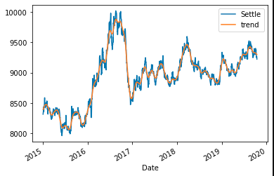
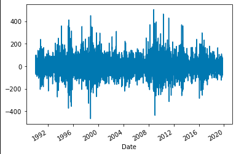
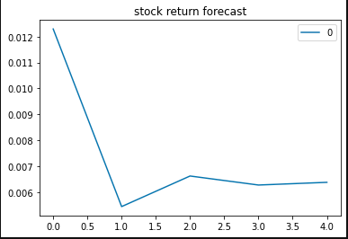
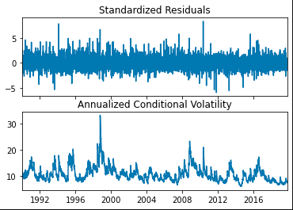
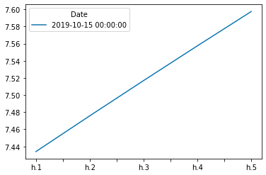
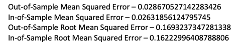

# Yen for the Future

## Background

The financial departments of large companies often deal with foreign currency transactions while doing international business. As a result, they are always looking for anything that can help them better understand the future direction and risk of various currencies. Hedge funds, too, are keenly interested in anything that will give them a consistent edge in predicting currency movements.

In this assignment, I tested time-series tools learned in order to predict future movements in the value of the Japanese yen versus the U.S. dollar.

I gained proficiency:

1. Time Series Forecasting
2. Linear Regression Modeling

- - -

### Files

I used the following to complete this assignment. 

[Time-Series Starter Notebook](Starter_Code/time_series_analysis.ipynb)

[Linear Regression Starter Notebook](Starter_Code/regression_analysis.ipynb)

[Yen Data CSV File](Starter_Code/yen.csv)

- - -

#### Time-Series Forecasting

In this notebook, I loaded historical Dollar-Yen exchange rate futures data and applied time series analysis and modeling to identify any predictable behavior.

Following steps outlined in the time-series starter notebook I completed the following:

1. Decomposition using a Hodrick-Prescott Filter (Decompose the Settle price into trend and noise).

2. Forecasting Returns using an ARMA Model.

3. Forecasting the Settle Price using an ARIMA Model.

4. Forecasting Volatility with GARCH.

I answered the following using the results of the time series analysis and modeling:

1. Based on your time series analysis, would you buy the yen now?
    No I would not, I believe the opprotunity cost is to high. The trend over time is not enough to manage the increasing risk.
2. Is the risk of the yen expected to increase or decrease?
    Yes, as shown in the GARCH, the risk is expected to increase
3. Based on the model evaluation, would you feel confident in using these models for trading?
    Yes, I believe the models are good.

#### Linear Regression Forecasting

In this notebook, I built a Scikit-Learn linear regression model to predict Yen futures ("settle") returns with *lagged* Yen futures returns and categorical calendar seasonal effects (e.g., day-of-week or week-of-year seasonal effects).

Following steps outlined in the regression_analysis starter notebook I completed the following:

1. Data Preparation (Creating Returns and Lagged Returns and splitting the data into training and testing data)
2. Fitting a Linear Regression Model.
3. Making predictions using the testing data.
4. Out-of-sample performance.
5. In-sample performance.

I answered the following using the results of the linear regression analysis and modeling:

1. Does this model perform better or worse on out-of-sample data compared to in-sample data?
    While the two predictions are mathmatically similar to each other, the model performs better on In-Sample Data. 

- - -